# Тестовое задание для DevOps Cloud.ru Camp 2025
Результаты выполнения тестового задания следует опубликовать на GitHub или захостить на любой открытой платформе (например, Github Pages) и отправить на указанную в письме почту. Также следует указать свои контактные данные для получения обратной связи - e-mail, ФИО, телефон.

Тестовое задание состоит из четырех задач.
## 1. Web приложение на Python/Golang
### Цель
Написать простейший echo-server на Python или Go
### Задача
Требуется написать простое веб-приложение на Python/Go, которое слушает входящие соединения на порту 8000 и предоставляет страницу с информацией:
- имя хоста
- ip адрес хоста
- имя автора, которое передаётся через переменную окружения $AUTHOR

Создаем файл в нашей директории с названием app.py и пишем наше просто приложение

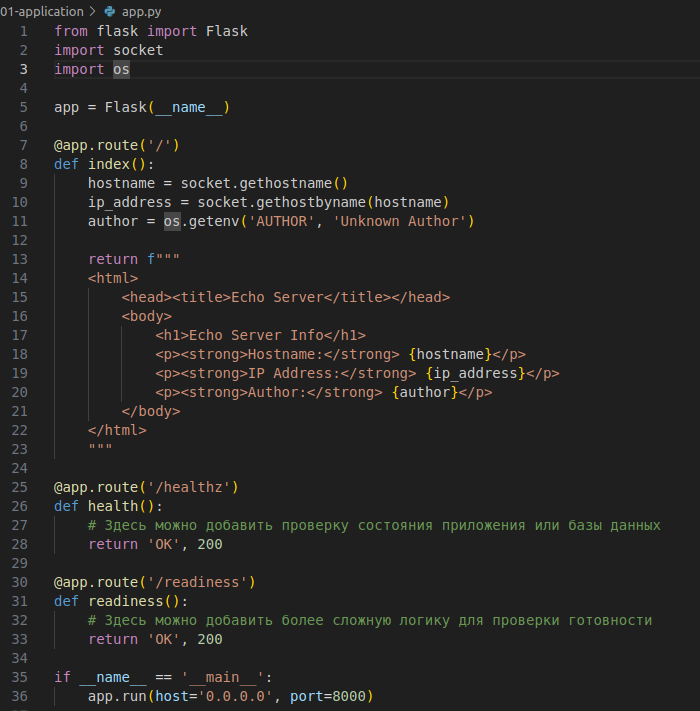

Для приложения написать Dockerfile и запушить образ в докер хаб* (запушить в приватный регистри - пройти регистрацию в докер хаб, сделать регистри приватным).

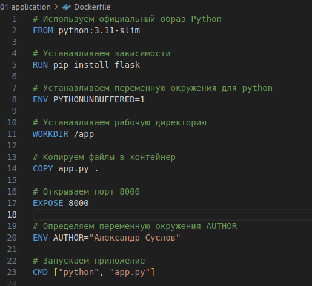

После этого нам надо собрать образ командой docker build -t selenesa/my-flask-app:v2 .

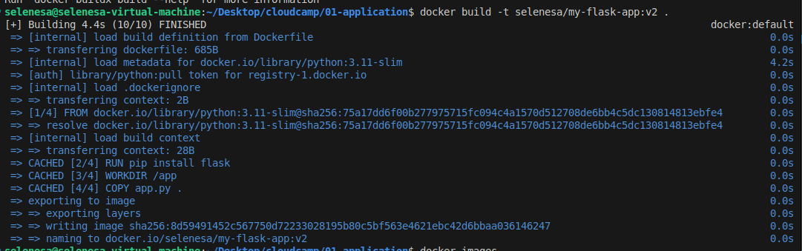

Далее выполняем команду docker login для авторизации в докерхабе и команду docker push selenesa/my-flask-app:v2 для того чтобы запушить наш образ в докерхаб.

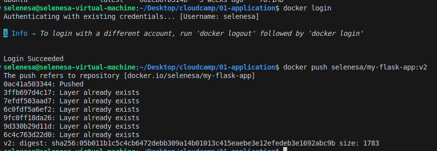

В ответе к задаче приложить:
- исходный код
- Dockerfile
- команды, которые использовались для пуша образа в регистри

Полученный артефакты положить в папку /01-application

## 2. Ansible playbook или роль
### Цель
Автоматизация конфигурации на Ansible
### Задача
Требуется поднять Виртуальную Машину (VM) с ОС Ubuntu 22.04. Возможные сценарии: локально через Virtual Box (или любое другое средство виртуализации), либо воспользовавшись Free-tier предложением от cloud.ru - https://cloud.ru/offers/free-tier.

Поднималась виртуальная машина с помощью приложения vagrant+virtualbox.
На данном скрине показан мой вагрант файл который я использовал.

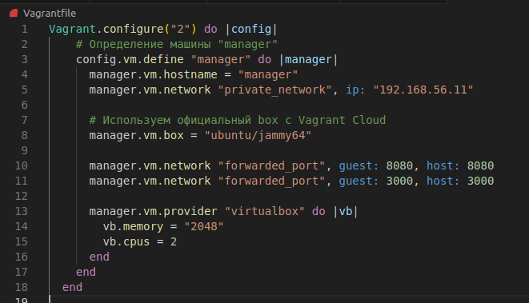

Далее установил ansible на свой хост и написал playbook для ansible.
На скринах показан рабочий playbook

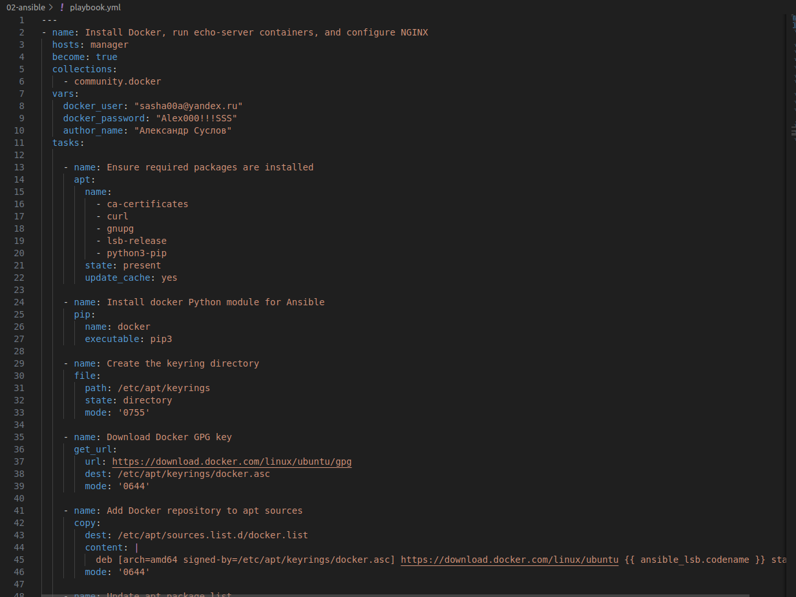

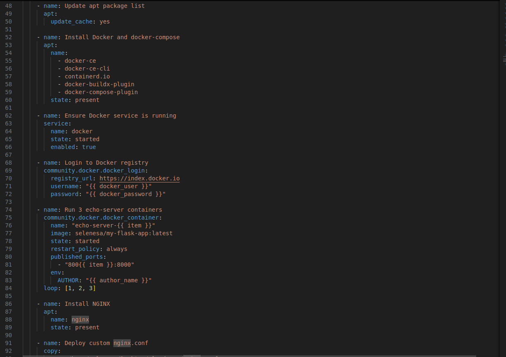

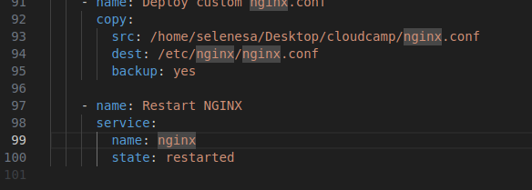

Далее нужно создать файл inventory чтобы ansible знад куда устанавливать и где разворачивать наше приложение.

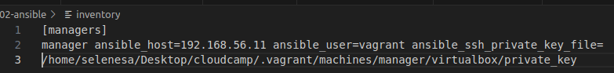

После этого по заданию нужно создать балансировщик трафика nginx поэтому создаем файл nginx.conf

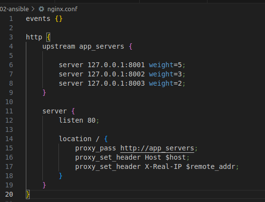

Теперь можно запускать наш ansible плейбук командой ansible-playbook -i inventory playbook.yml

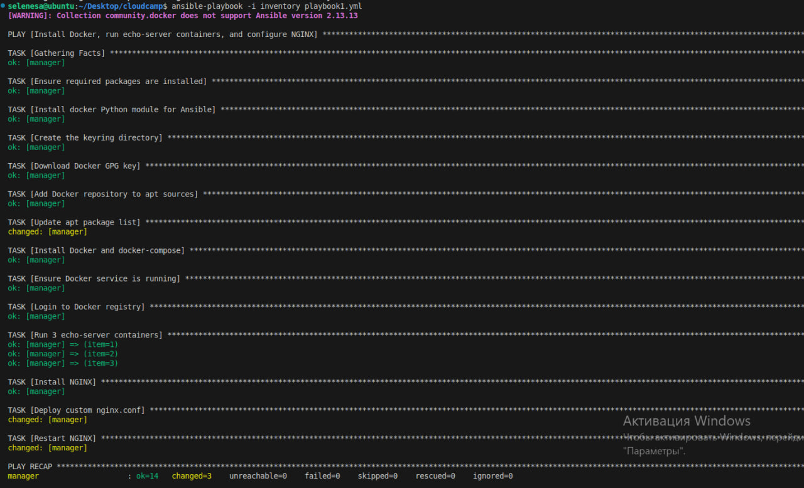

Далее видим что наш playbook работает 

Выполнить следующие задачи, используя Ansible:
1. На VM установить пакет docker-ce;
2. Запустить на docker контейнеры c подготовленным Web-приложением из первой задачи в 3-х экземплярах. Для развёртывания использовать приватный регистри из первой задачи;
3. Настроить балансировщик на nginx, который будет отвечать при обращении к хосту и прокидывать запрос на запущенные контейнеры. Выбрать алгоритм балансировки для приложения и обосновать свой выбор.

В ответе к задаче приложить:
- исходный код Ansible
- текстовое обоснование выбранного алгоритма балансировки

Полученные артефакты положить в папку /02-ansible

## 3. Kubernetes manifest
### Цель
Деплой приложения в Kubernetes
### Задача
Требуется написать манифест для запуска приложения из первой задачи в Kubernetes в отдельном неймспейсе в виде Deployment с 3 репликами и сервиса с типом ClusterIP. 

Выполнить следующие задачи:
1. Для приложения организовать проброс значения переменной AUTHOR;
2. Реализовать readiness- и liveness- пробы;
3. Использовать образ из приватного регистри из задачи 1;
4. опционально: поднять ingress-controller и создать правило ingress;
5. опционально: использовать helm-chart, а не raw манифест.

В ответе к задаче приложить:
- исходный код всех манифестов

Полученные артефакты положить в папку /03-kubernetes

## 4. Запереть контейнер изнутри* (дополнительное необязательное задание)
### Цель
Проверить навыки администрирования *nix
### Задача
1. Создать ВМ с ОС Ubuntu 22.04;
2. Установить пакет docker-ce;
3. Выполнить команду docker run -it --rm ubuntu -- bash;
4. Не покидая контейнер, не меняя флаги запуска и настройки демона, выполнить задачи:\
4.1. сделать apt-get update, показать, что команда выполняется успешно;\
4.2. изнутри контейнера заблокировать ему выход в сеть интернет, команды блокировки с описанием приложить к задаче;\
4.3. показать, что apt-get update больше не работает.
5. Доп. задача - найти ещё +1 способ выполнить подобную блокировку изнутри контейнера.

В ответе к задаче приложить:
- текстовое описание применённых конфигураций

Полученные артефакты положить в папку /04-unix